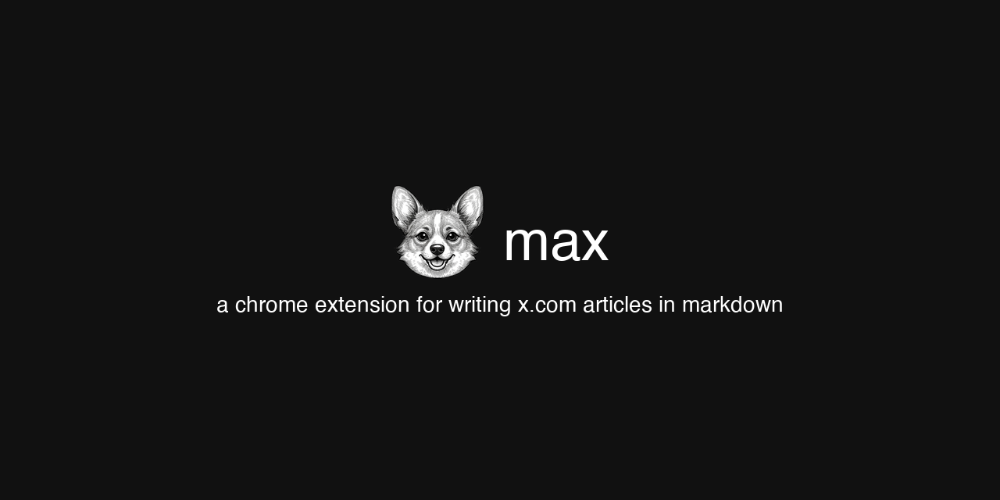

<p align="center">
  
</p>

## install

```bash
git clone https://github.com/agenticnotetaking/max.git
```

1. open `chrome://extensions`
2. enable **Developer mode** (top right)
3. click **Load unpacked** → select the cloned folder
4. go to [x.com/compose/articles](https://x.com/compose/articles)
5. click the max icon in the toolbar — side panel opens
6. write markdown, hit **Sync to X**

the extension comes preloaded with an example article that demos every supported format. hit sync to see how it looks in X's editor, then clear it and start writing.

## what it does

write your article in markdown in the side panel. hit sync. max parses it, writes formatted HTML to the clipboard, and pastes it into X's article editor.

- **bold**, *italic*, ~~strikethrough~~, headings, lists, blockquotes, links
- select text to sync just that section
- add a header image via the media tray or drag-and-drop
- auto-saves to localStorage

### shortcuts

| key | action |
|-----|--------|
| `Cmd+B` | bold |
| `Cmd+I` | italic |
| `Cmd+K` | link |
| `Tab` | indent |

## format mapping

X's article editor doesn't support all HTML via paste. max maps markdown to what actually works:

| markdown | pastes as |
|----------|-----------|
| `# heading` | `<h2>` — X reserves h1 for the title field |
| `**bold**` | `<strong>` |
| `*italic*` | `<em>` |
| `~~strike~~` | `<s>` |
| `- list` | `<ul><li>` |
| `1. list` | `<ol><li>` |
| `> quote` | `<blockquote>` |
| `[text](url)` | `<a href>` |
| `` `code` `` | `<strong>` — no inline code via paste |
| ```` ``` ```` | `<blockquote>` — use X's toolbar for code blocks |
| `---` | `· · ·` — use X's toolbar for separators |

## limitations

- **code blocks and separators** — X only supports these via its own toolbar, not HTML paste. max renders them as blockquotes and `· · ·` dividers. after syncing, use X's insert menu to convert.
- **images** — the media tray uploads to X's header image slot, not inline. inline images must be added manually in X's editor after syncing. upload depends on X's file input being in the DOM — if it skips, refresh the article page.
- **h1** — X reserves h1 for the article title. all headings paste as h2/h3.

## license

MIT
